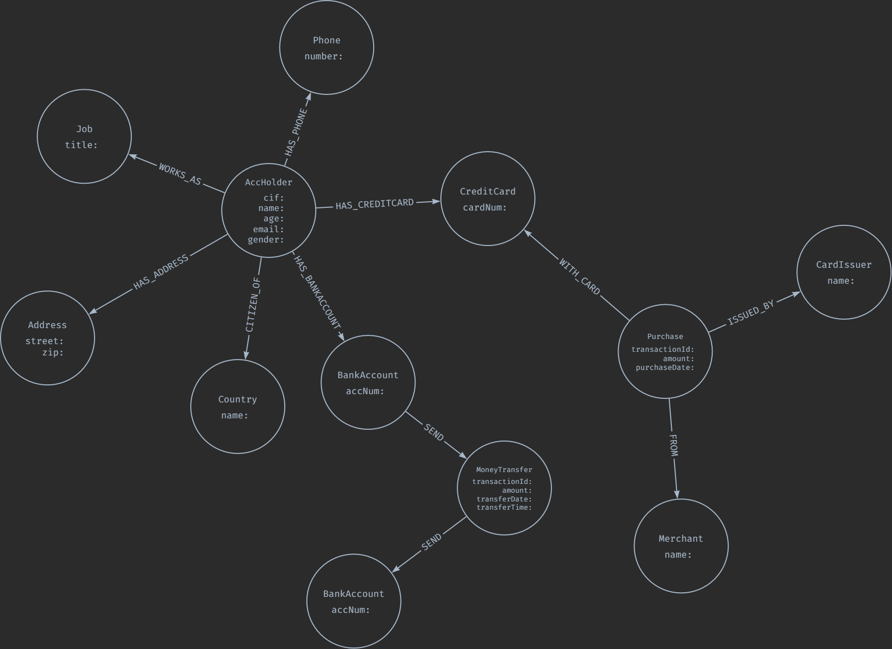
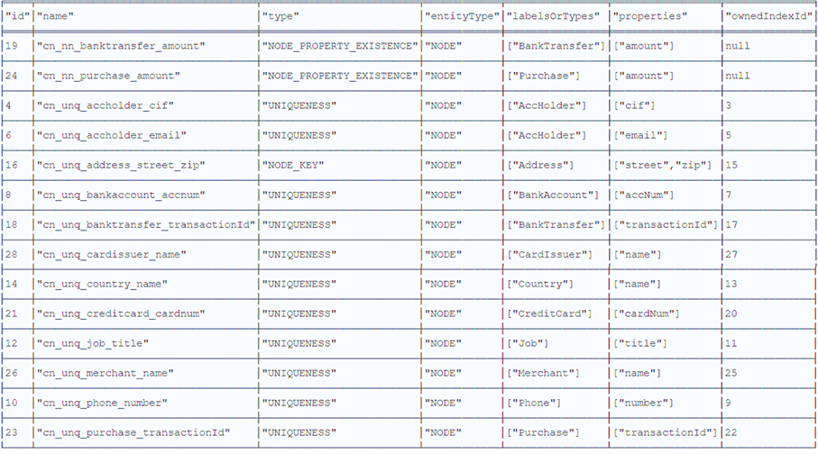

# Neo4j Demo Application
## How to setup?
1. Clone the repository
2. Setup the Python environment
    * Create a new Python(3.9) virtual environment for the project<br>
    * Install the required Python packages using the *requirements.txt*
3. Start the Neo4j Enterprise docker
    * Issue ```docker-compose up``` command from the root directory<br>
    Note: *plugins folder contains the neo4j's extension library - APOC*
    * Login to Neo4j Browser: http://localhost:7474<br>
    Username: *neo4j*, Password: *test*

## Data Model
The image below illustrates the proposed graph data model for the banking dataset (https://gist.github.com/maruthiprithivi/f11bf40b558879aca0c30ce76e7dec98) provided.


### Constraints
The table below shows the constraints used to ensure the data integrity of the proposed data model.

## Import Data
Note: *Duplicate records (based on the TransactionID) have been removed from transfers.csv and purchases.csv.* 
1. Run all the cells in *app-python/ingestion.ipynb* to create the graph data model and load the data from the CSV files (customer, transfers, and purchases) residing in the *data/banking* folder.
Alternatively, you can run the *ingestion.py* file in the app-python folder as follows:
```
    cd app-python
    python ingestion.py
```

## Exploratory Analysis
The *analysis.ipynb* file inside the *app-python* folder contains the cypher queries-based functions used to identify a few useful patterns based on the dataset and the proposed data model.